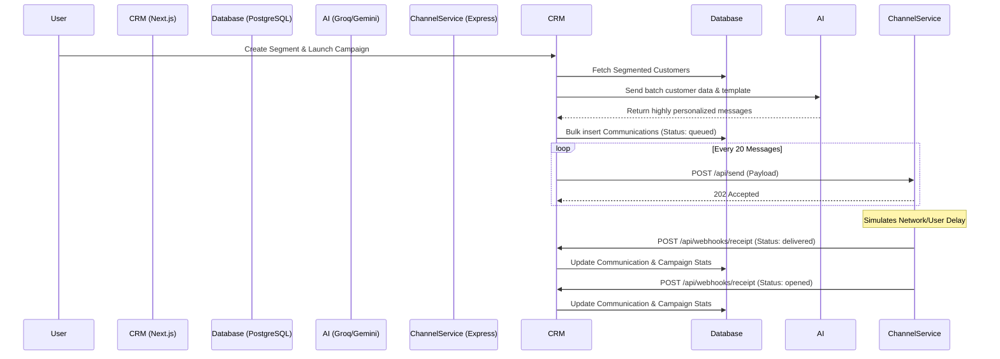

# Architecture Overview

ReachNext is built on a decoupled, monorepo architecture. The core application (CRM) handles the heavy lifting of data management and AI personalization, while message delivery is offloaded to an external service, communicating entirely via HTTP and Webhooks.

---

## System Architecture

### The CRM (Next.js)
The core application is a full-stack Next.js 15 application utilizing the App Router. 
- **Frontend Layer**: Built with React 19, Tailwind CSS v4, and Shadcn UI components. It provides the dashboard for segment building and campaign drafting.
- **Backend Layer**: Consists of Next.js API Routes. It handles direct communication with the PostgreSQL database via Prisma ORM.
- **AI Integration**: The backend directly interfaces with Groq and Google Gemini to offload complex natural language processing tasks, such as generating segment insights and writing personalized message copy in bulk.

### The Channel Service (Express)
A completely separate Node.js/Express application that acts as an external SMS/Email provider simulator.
- **Role**: It receives formulated message payloads from the CRM.
- **Simulation**: Instead of actually sending an email or SMS, it introduces randomized asynchronous delays to simulate network delivery.
- **Webhooks**: It fires HTTP POST requests back to the CRM containing delivery receipts (e.g., `delivered`, `opened`, `clicked`), mimicking a real-world provider like Twilio or SendGrid.

---

## Execution Flow

When a user launches a campaign, the system executes the following sequence:



---

## Monorepo Structure

The codebase is organized into two independent projects that run concurrently during development:

```text
xeno-mini-crm/
├── crm/                     # The core Next.js Application
│   ├── app/                 # Frontend UI & API Routes (Next.js App Router)
│   ├── components/          # Shadcn UI & React Components
│   ├── lib/                 # AI integrations (Groq/Gemini) & Utilities
│   ├── prisma/              # PostgreSQL Schema & Seed Scripts
│   └── services/            # Core business logic (CampaignSender, SegmentEngine)
│
├── channel-service/         # The mock delivery microservice
│   └── src/                 # Express.js server & webhook simulation logic
│
└── .env.example             # Shared environment variable templates
```

---

## Technology Stack

### Frontend
*   **Framework**: Next.js 15 (App Router)
*   **Library**: React 19
*   **Styling**: Tailwind CSS v4
*   **Components**: Shadcn UI & Base UI
*   **Charting**: Recharts
*   **Icons**: Lucide React

### Backend
*   **Core**: Next.js API Routes
*   **Microservice**: Node.js & Express (`channel-service`)
*   **ORM**: Prisma

### Database
*   **Engine**: PostgreSQL (accessed via the `pg` driver)

### Artificial Intelligence
*   **Primary API**: Groq API (fast inference for personalization)
*   **Secondary API**: Google Gemini API (via `@google/generative-ai`)
