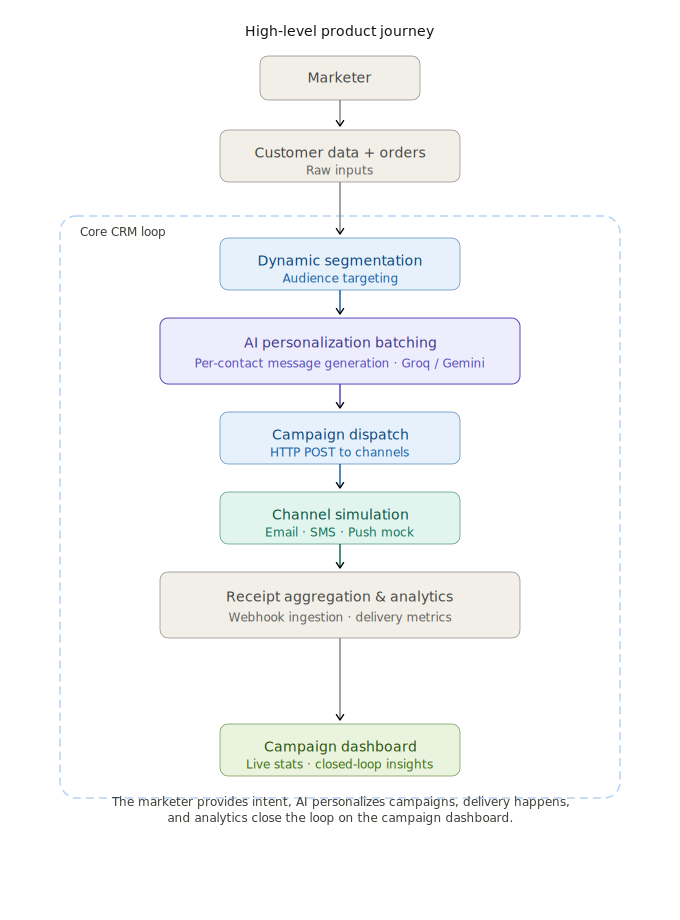
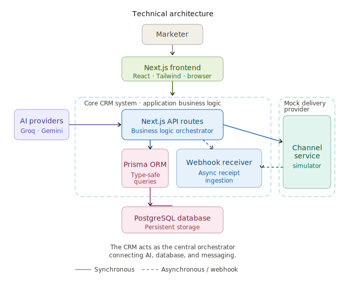
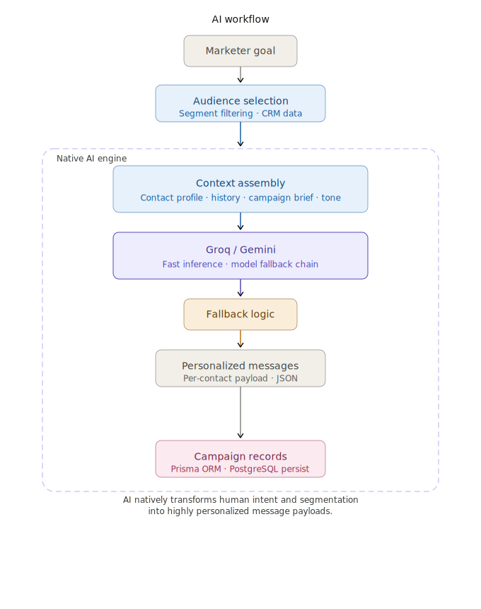
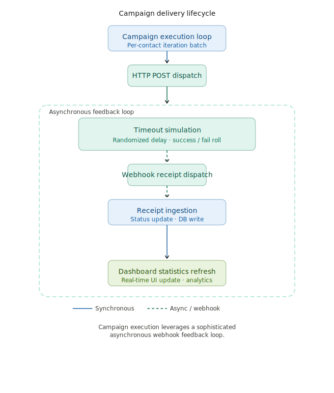
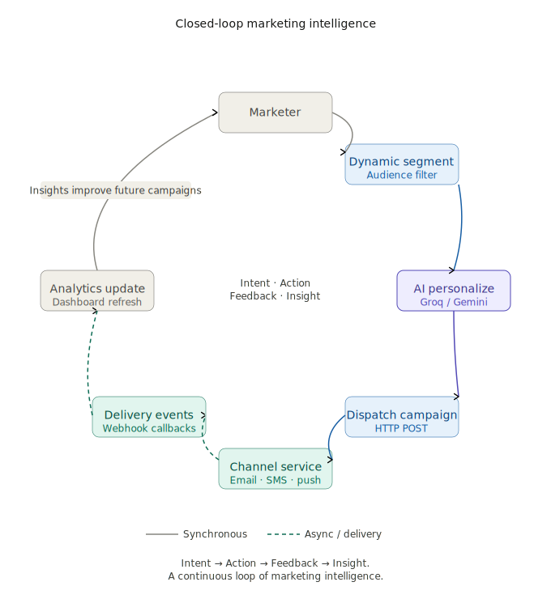

# ReachNext

Intelligent Customer Management and Campaign Execution. Turn customer data into highly targeted, personalized campaigns in minutes.

---

## 🏅 Badges

---

## 🌐 Live Demo

*   **Main Application**: [https://reach-next-iota.vercel.app](https://reach-next-iota.vercel.app)
*   **Channel Service**: [https://reachnext-channel-service.onrender.com](https://reachnext-channel-service.onrender.com)

---

## 🎯 The Challenge & Approach

The assignment required building a system to ingest data, segment shoppers, send personalized communications, and track performance using a stubbed channel service—all while being deeply "AI-native."

Instead of bolting an AI chatbot onto a traditional SaaS interface, ReachNext is built as a true AI agent (Co-pilot). The marketer describes their intent in natural language (e.g., "Send a WhatsApp thank you message to my top 5 most loyal customers"), and the AI autonomously handles the data querying, segmentation, copywriting, reach estimation, and campaign launch.

---

## ✨ Features

### 1. Intelligent Segmentation
Group customers using complex data rules (e.g., total spend, city, total orders). The segmentation engine queries the PostgreSQL database dynamically to instantly isolate target audiences.

### 2. AI-Powered Campaign Personalization
Uses Groq or Google Gemini to process batches of customer data. For each recipient, the AI analyzes their unique attributes (name, location, spending history) and automatically rewrites the base campaign template into a highly personalized message.

### 3. Automated Campaign Dispatch
Synchronously evaluates segmented customers, delegates message personalization to the AI services, and bulk-inserts the communications into the database. The system then batches the finalized payloads and dispatches them via HTTP to the delivery channel.

### 4. Real-Time Delivery Webhooks
Features a dedicated webhook listener endpoint (`/api/webhooks/receipt`). The system receives continuous updates regarding message status (queued, sent, delivered, opened, clicked, converted, failed) and automatically aggregates these statistics onto the parent campaign.

### 5. Mock Delivery Simulation
Includes a dedicated microservice (`channel-service`) that mimics real-world email/SMS providers. When a campaign is launched, this service accepts the payloads and fires randomized, asynchronous webhook receipts back to the CRM to simulate the lifecycle of a marketing blast.

---

## 🏗️ Architecture

### 1. Product Journey

  

### 2. Technical Architecture

  

### 3. AI Workflow

  

### 4. Campaign Delivery Lifecycle

  

### 5. Closed-Loop Marketing Intelligence

  

---

## 🛠️ Tech Stack

**Frontend**
*   Next.js 15 (App Router)
*   React 19
*   Tailwind CSS v4
*   Shadcn UI & Base UI
*   Recharts
*   Lucide React

**Backend**
*   Next.js API Routes
*   Node.js & Express (`channel-service`)
*   Prisma ORM

**Database**
*   PostgreSQL (`pg`)

**AI**
*   Groq API
*   Google Gemini API (`@google/generative-ai`)

---

## 🚀 Demo Walkthrough

1.  **Launch Both Servers**: Ensure the CRM is running on `:3000` and the Channel Service on `:3001`.
2.  **Create a Segment**: Navigate to the Segments tab and create a rule (e.g., `Total Spent > 500`).
3.  **Draft a Campaign**: Navigate to Campaigns, select your new segment, and write a base template using placeholder tags like `[Name]` and `[City]`.
4.  **Launch**: Click send. The CRM will securely batch your segment data to the configured AI provider, retrieve personalized messages, and dispatch them to the Channel Service.
5.  **Watch Real-Time Analytics**: Stay on the campaign dashboard. You will see the delivery statistics (Sent, Delivered, Opened, Clicked) update in real-time as the Channel Service fires simulated webhooks back to the CRM.

---

## ⚠️ Known Limitations

*   **No Authentication**: The application currently has no login system, authentication middleware, or user authorization.
*   **Single Tenant Architecture**: The database and UI are designed for a single organization. There is no multi-tenant workspace isolation.
*   **Simulated Delivery Network**: The platform does not currently connect to real-world SMS or Email providers (like Twilio or SendGrid), relying entirely on the local `channel-service` for delivery resolution.
*   **Synchronous Dispatch Queueing**: Campaign processing and dispatching occur within the lifecycle of a Next.js API route. Extremely large audience segments could result in API timeouts due to the lack of a dedicated background worker queue.

---

## 🔮 Future Improvements

*   **Implement Resilient Background Queues**: Introduce Redis and BullMQ to extract the `CampaignSender` logic out of the Next.js API route, allowing for resilient, retryable background job processing for massive audience segments.
*   **Authentication & Multi-Tenancy**: Integrate NextAuth.js or Clerk and update the Prisma schema to relate Customers, Segments, and Campaigns to specific Organization IDs.
*   **Real Provider Adapters**: Build polymorphic adapters in the services layer to swap out the `channel-service` URL with direct API integrations for Twilio, SendGrid, and WhatsApp Business.
