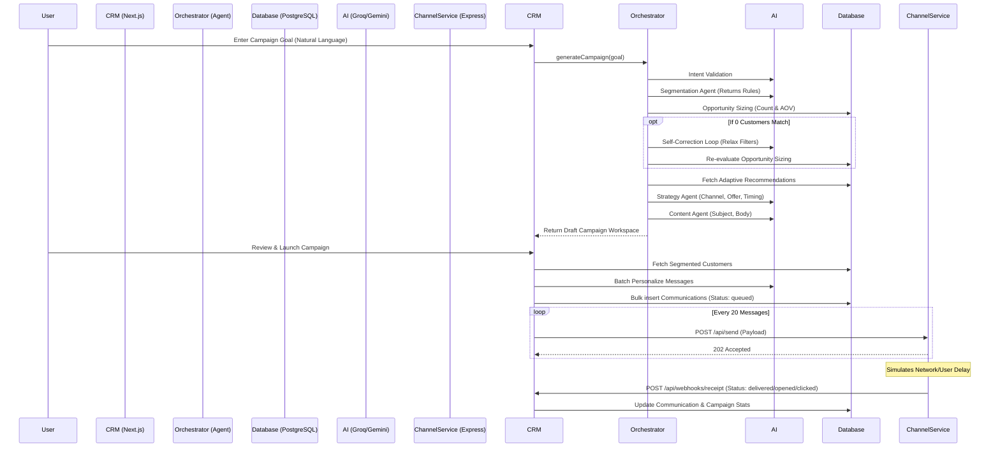

# Architecture Overview

ReachNext is built on a decoupled, monorepo architecture. The core application (CRM) handles the heavy lifting of data management and AI personalization via a sophisticated multi-agent system, while message delivery is offloaded to an external service, communicating entirely via HTTP and Webhooks.

---

## System Architecture

### The CRM (Next.js)
The core application is a full-stack Next.js 15 application utilizing the App Router. 
- **Frontend Layer**: Built with React 19, Tailwind CSS v4, and Shadcn UI components. It provides the dashboard for interacting with the AI autopilot, reviewing generated campaigns, and tracking performance.
- **Backend Layer**: Consists of Next.js API Routes. It handles direct communication with the PostgreSQL database via Prisma ORM.
- **AI Integration (Agent Orchestrator)**: The backend uses a complex `AgentOrchestrator` that chains multiple LLM agents (powered by Groq and Google Gemini) to autonomously handle intent validation, segmentation, database opportunity sizing, strategy recommendation, and content generation.

### The Channel Service (Express)
A completely separate Node.js/Express application that acts as an external SMS/Email provider simulator.
- **Role**: It receives formulated message payloads from the CRM.
- **Simulation**: Instead of actually sending an email or SMS, it introduces randomized asynchronous delays to simulate network delivery.
- **Webhooks**: It fires HTTP POST requests back to the CRM containing delivery receipts (e.g., `delivered`, `opened`, `clicked`), mimicking a real-world provider like Twilio or SendGrid.

---

## Multi-Agent Architecture (Agent Orchestrator)

The CRM utilizes an autonomous `AgentOrchestrator` to generate marketing campaigns from natural language. When a user inputs a goal, the following agents are triggered in sequence:

1. **Intent Validation Agent**: Analyzes the natural language goal to determine the user's intent and confidence score. If confidence is low, it asks for clarification.
2. **Segmentation Agent**: Translates the normalized goal into specific database query rules (e.g., "last order > 45 days ago").
3. **Opportunity Sizing & Self-Correction (Database)**: Runs the segmentation rules against the live database. If 0 customers match, a **Self-Correction Loop** automatically relaxes the most restrictive filters (by querying database aggregates) until a valid audience is found.
4. **Adaptive Recommendation Engine**: Analyzes historical campaigns to recommend the best channel, timing, and offer based on past performance.
5. **Strategy Agent**: Formulates a concrete strategy (Channel, Offer, Timing) utilizing insights from the Adaptive Recommendation Engine and database sizing.
6. **Content Agent**: Generates a personalized message template (Subject and Body) tailored to the target segment and strategy.

---

## Execution Flow

When a user initiates an AI campaign, the system executes the following sequence:



---

## Monorepo Structure

The codebase is organized into two independent projects that run concurrently during development:

```text
xeno-mini-crm/
├── crm/                     # The core Next.js Application
│   ├── ai/                  # AI agents, schemas, and logic
│   ├── app/                 # Frontend UI & API Routes (Next.js App Router)
│   ├── components/          # Shadcn UI & React Components
│   ├── lib/                 # Shared utilities, Prisma instance, and AI setup
│   ├── prisma/              # PostgreSQL Schema & Seed Scripts
│   └── services/            # Core business logic (AgentOrchestrator, CampaignSender, etc.)
│
├── channel-service/         # The mock delivery microservice
│   └── src/                 # Express.js server & webhook simulation logic
│
└── .env.example             # Shared environment variable templates
```

---

## Technology Stack

### Frontend
*   **Framework**: Next.js 15 (App Router)
*   **Library**: React 19
*   **Styling**: Tailwind CSS v4
*   **Components**: Shadcn UI & Base UI
*   **Charting**: Recharts
*   **Icons**: Lucide React

### Backend
*   **Core**: Next.js API Routes
*   **Microservice**: Node.js & Express (`channel-service`)
*   **ORM**: Prisma

### Database
*   **Engine**: PostgreSQL (accessed via the `@prisma/adapter-pg` / `pg` driver)

### Artificial Intelligence
*   **Primary API**: Groq API (fast inference for personalization and orchestration)
*   **Secondary API**: Google Gemini API (via `@google/generative-ai` for specialized analysis)
*   **Validation**: Zod (for structured AI outputs)
